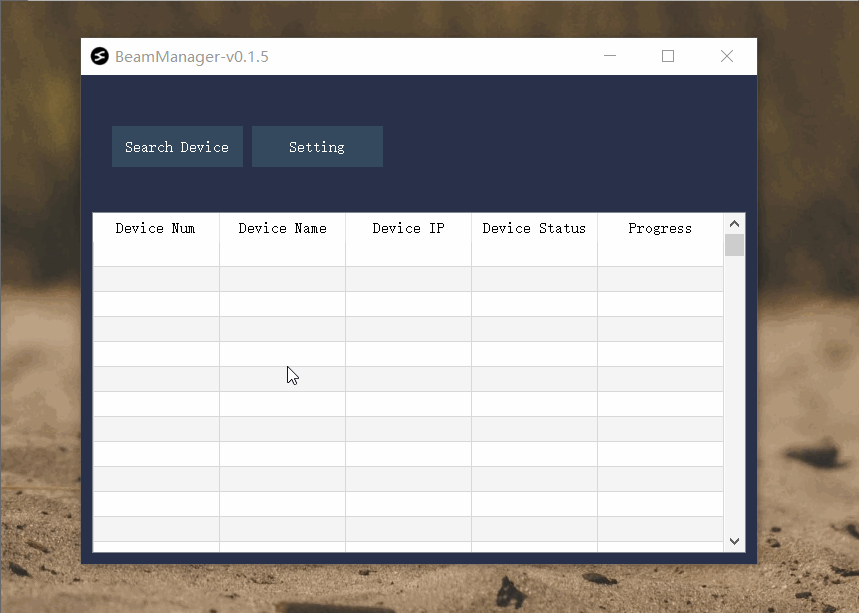
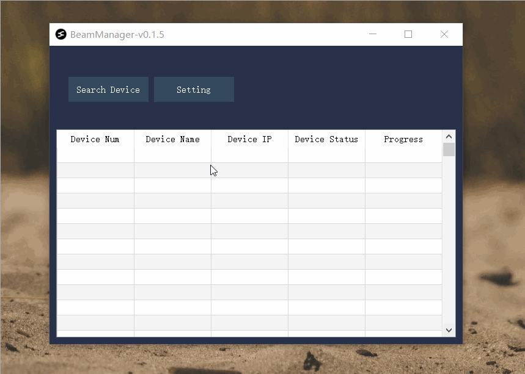
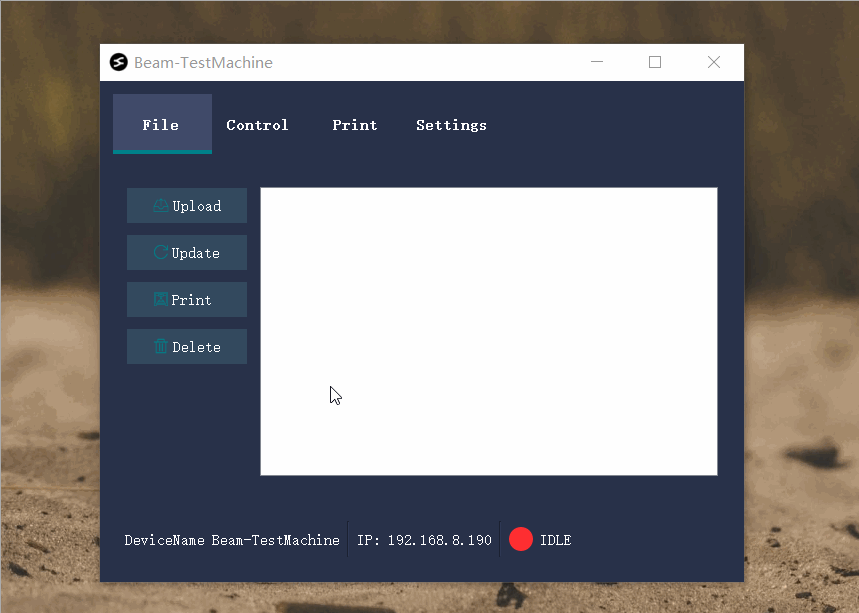
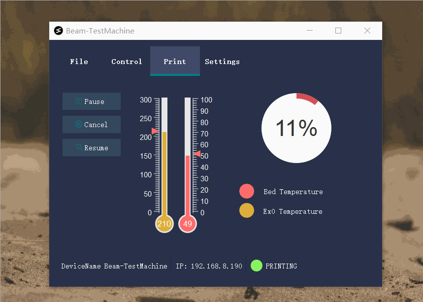
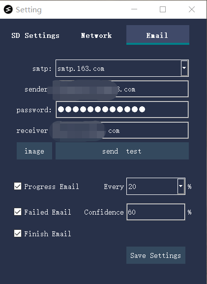

<h1 align="center">Beam-ESP32</h1>

  
   

## 1. 工程目录说明

- 依赖: Espressif System 1.0.6

## 2. Beam项目介绍

### 2.1 什么是Beam？

Beam是一款针对FDM打印机，让其备具备wifi文件传输和wifi控制打印的功能的一个模块。区别于树莓派，Beam使用了更加简洁的微处理器来处理这些任务。
它包含如一些特点:

- Really easy to config(Plug & Play)
- 不依赖互联网，不依赖任何云功能
- 与打印机之间的数据传输更快，更稳(SD卡打印)
- 设备兼容性好，不需要做任何配置，即可兼容大部分机型(得益于UsbHost SD 技术)
- 非常容易扩展多台设备，一台PC管理许多不同型号不同厂家的3D打印机
- 更低的硬件成本投入
- 配合BeamManager，可实现邮件提醒进度
- 提供简单的RestfulAPI 来让其他的软件控制(比如postman这种调试工具)
- 包含扩展接口(IIC, UART, 单反控制电路)
- 与ESP32-Camera配合，可以实现延时摄影制作,按照进度拍照并邮件提醒，PC本地打印失败检测和烟雾火苗检测，所有这些不依赖注册账号和网络

Beam为了更好的实现自己的功能，开发了自己的电子硬件，建立了开源社区。定制硬件，可以让用户得到更好的体验，而不是拼凑出来的功能。Beam是一个完整的解决方法，软硬件之间的结合更加和谐融洽，只有同时两者兼顾，才可能达到开箱即用的体验。

### 2.2 为什么做Beam?

我们为什么要做Beam？总结下来有如下几条原因:

- 树莓派安装和使用Octoprint的门槛对于普通人来说，还是很高
- 我们不想拆机器接线来让3D打印机具备一些额外的功能
- 我们不希望使用云来监控，不希望将我们的打印文件上传到他人的服务器上
- 树莓派不便宜，当有多台打印机时，工作量是多倍。
- 当我们有多台不同型号不同厂家的3D打印机时，如果要统一管理，非常麻烦
- 云服务器很贵,尤其是AI推理的服务器。我们希望使用监控功能,使用本地的PC的CPU资源实现AI监控技术

使用Beam，可以完美的避开上面所列举的问题，实现Plug & Play

## 3. 使用说明

### 3.1 上位机的网络要求

请确保您的网络中有2.4G网络，ESP32目前只能连接2.4G的wifi。 此外，360或者一些杀毒软件，电脑设置了静态IP, VPN等，会对设备查找产生影响。 如果要使用自动搜索设备，请确保您的电脑的IP网段跟路由器的网段保持一致。

### 3.2 快速上手使用

1. 配网

插入SD卡后，配置SD卡

2. 局域网设备扫描

3. 控制打印

控制面板和上传文件:

4. 打印

5. 邮件配置

邮件可以配置每打印完多少百分比，拍摄一张图片，给指定的邮箱发送提醒邮件。打印失败提醒是当软件检测到有打印失败概率时，发邮件通知用户(配合Camera拍摄)。

## 4.Beam-API

Beam对外提供了核心的API，来实现让更多的平台接入他进行控制。下面列举出Beam已经包含的API以及具体的使用。[API文档](./FP-BeamAPI.md)

## 5.如何更新Beam-ESP32固件

1. 下载烧录[工具](https://github.com/fiberpunk1/Beam-ESP32/releases/download/Beta-v0.1.0/BeamFlash-Installer.exe)
2. 在Beam-ESP32的release页面下，下载最先的 .bin文件
3. 按照下图所示顺序烧录固件:
