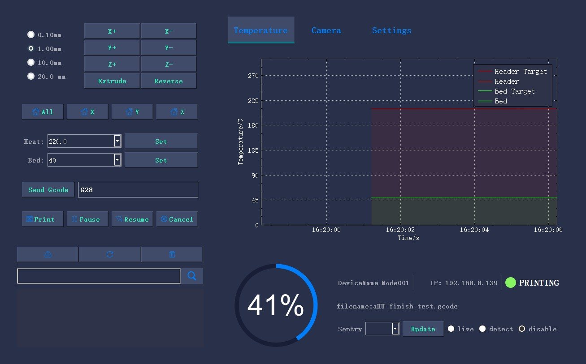
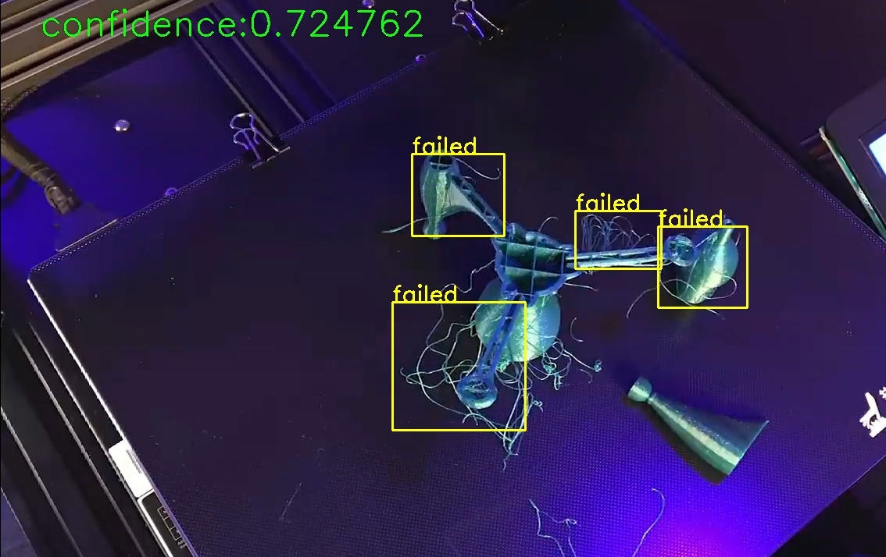
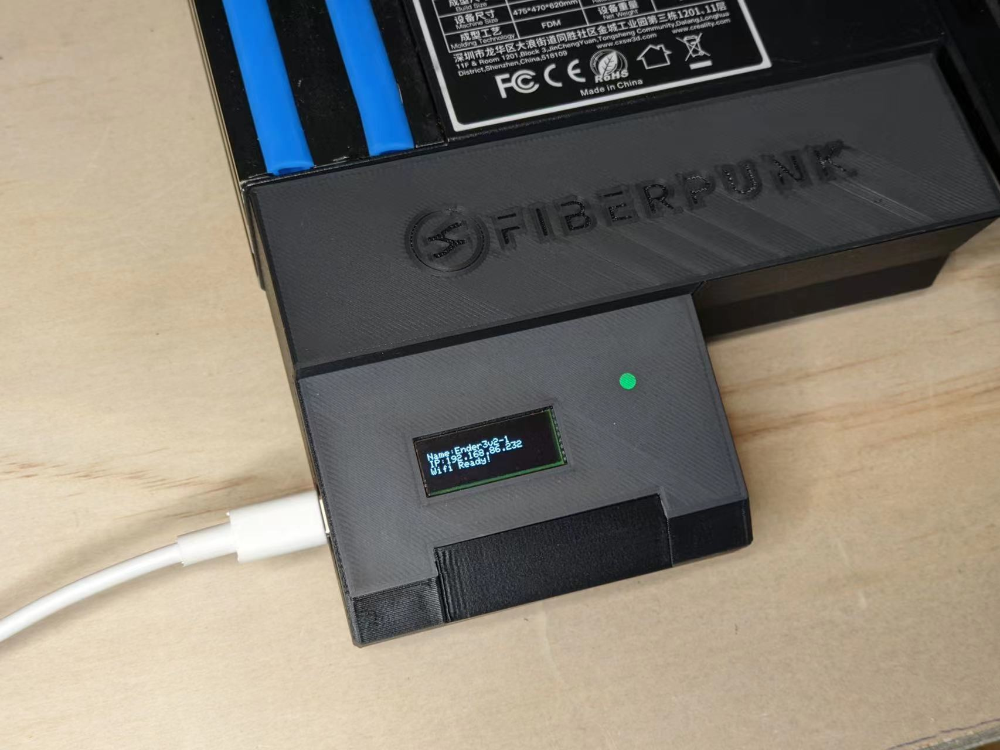
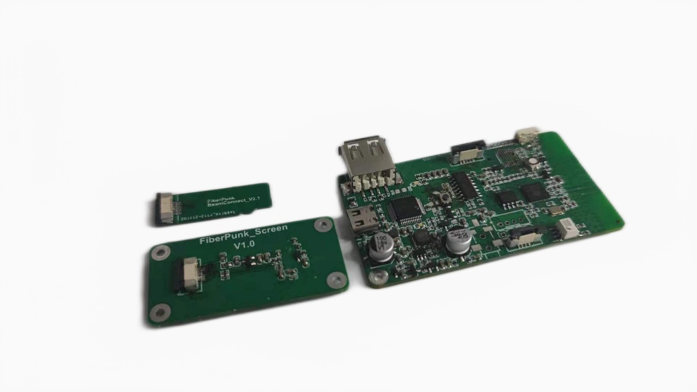
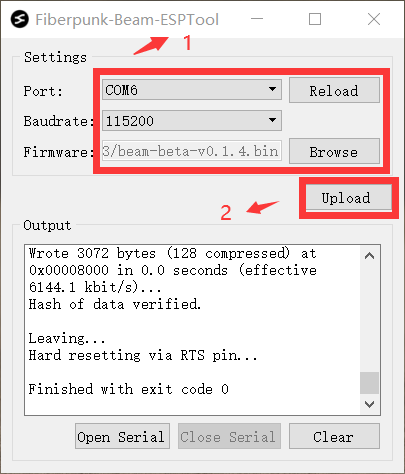

<h1 align="center">Beam-ESP32</h1>

  
   

## 1. Project catalog description

- Dependencies: Espressif System 1.0.6

## 2. Beam Project Introduction

**PC Client:**

### 2.1 What is Beam?

Beam is an easy and affordable way to control and monitor 3D printers via WiFi, USB-enabled serial, and SD I/O. Beam is very robust and power-efficient as it runs on an MCU (ESP32) while still offering a wide range of functionalities.

**Key features:**
- East to install - Beam can be installed by plugging into a printer’s USB-enabled serial connection and data cable to SD card slow. This means no opening up the printer and complicated wiring.
- Easy to set up - Beam can be set up to connect user network by simply running the desktop application or use web page, entering network credentials, and exporting the setting to sd card. 
- Beam has good compatibility with printers due to Beam only relying on serial connection for control and monitor and utilizing the high bandwidth SD I/O for transfer.
Faster and more reliable printing via Beam’s unique SD Card I/O bridge to printer
- Beam works with or without an external internet connection, and functionalities can be realized via BeamManager
- Easy to manage multiple printers with a single software control point
- Affordable hardware cost. No need to acquire a Pi for every printer
- Email Notification via BeamManger 
- Future Expandability with Beam Camera and Machine Vision for Failure Detection via BeamManager
- Provide simple RestfulAPI to allow other software control (such as postman debugging tools)
- Beam includes extended interfaces (IIC, UART, SLR control circuit) to work with ESP32-Camera. This allows for time-lapse photography production, taking photos according to the progress and email reminders, PC local printing failure detection, and smoke flame detection, all of which do not rely on registered accounts and networks.

**Nexus's local printing failure detection:**

**Node's lite web UI:**

**Node installed in Ender3-v2:**

### 2.Why Beam?

When we first look at adding WiFi control to our 3D printers, there are already excellent choices, such as the wonderful [Octoprint](https://github.com/OctoPrint/OctoPrint) project run by our good friend Gina with great plugins and [communities](https://octoprint.org/). Octoprint controls and transfers via serial connection only, which is limited by the speed of the connection and firmware compatibility issues. 

We want to challenge ourselves to see if there is a leaner, MCU based solution that can achieve these goals:

- Allows for faster print speed than serial connection, which is needed for newer printers, especially CoreXY Printer
- More compatibility with different printers
- Easy to install, especially for users who are new to 3D printing
- Simple to set up and manage a fleet of printers.
- Robust operation such that the device can be powered off immediately and does not rely on an Internet connection to function

To meet the above goals, we needed a tightly integrated solution that requires hardware that does not exist on the market. This led us to develop Beam’s ESP32 based board and the open-source firmware.  We also designed the unique SD Bridge that allows Beam to transfer GCode via high-speed SD I/O while controlling/monitoring via the serial connection.

## 3.Beam-API

Beam provides core APIs to enable more platforms(Such as [Octoprint](https://github.com/OctoPrint/OctoPrint),BeamManager, or postman tools) to access him for control. Listed below are the APIs already included in Beam and their specific usage.[API docs](./FP-BeamAPI.md)

## 4.How to update Beam-ESP32 firmware

1. Download [flash tool](https://github.com/fiberpunk1/Beam-ESP32/releases/download/Beta-v0.1.0/BeamFlash-Installer.exe)
2. On the Beam-ESP32 release page, download the first .bin file
3. Burn the firmware in the order shown in the following figure:

