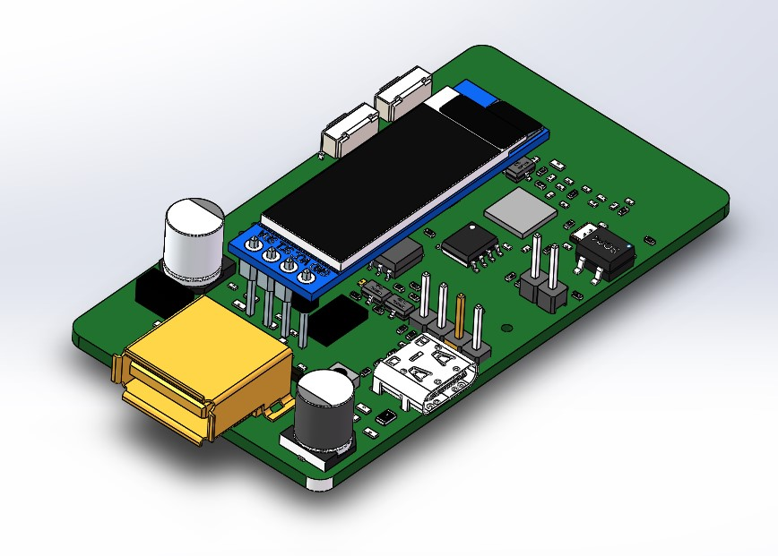
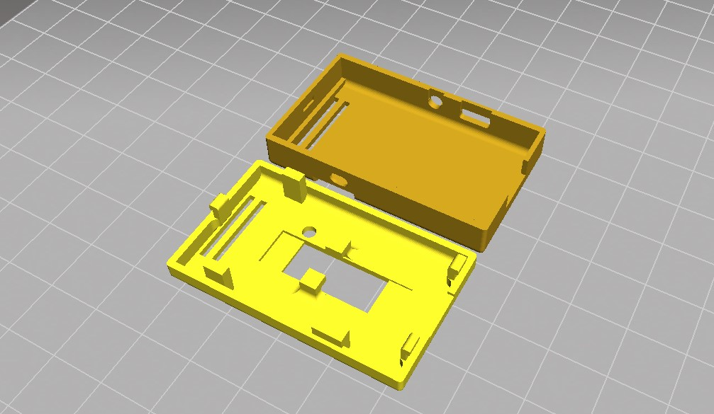

<p align="center"></p>

<h1 align="center">Beam-ESP32</h1>
<p align="center">
  
   

</p>

## 1. Project Description

- dependency: Espressif System 1.0.6


## 2. Introduction to Beam project

### 2.1 What is Beam？

Beam is a ESP32 based device with ability to monitor and control Marlin based printers via USB enabled serial. It has a micro-SD card to store gcode and settings and multiple i/o ports to connect with external devices.  Users can manage multiple Beams via applications running on desktop and phone apps via the network. We plan to expand support to other 3D printer firmware and non 3D printer firmware (CNC, Engraver and etc)


### 2.2 Why did we develop Beam？

More than 90% of FDM printers on the market are not network-enabled. This lack of connectivity limits printers to only local resources and is unable to be managed intelligently. For those FDM printers that have network access via WiFi, many require the user to open up a printer to add an extra module, while others may need to run a full operating system-enabled computer like Raspberry Pi.  There is no easy to set up, affordable and robust solution that is both plug and play and can be deployed quickly over many printers.  That was the problem we ran into when setting up our print farm, and we decided to develop Beam.

### 2.3 What makes Beam different from other solution

- East to install: Beam can be installed by simply plugged into a USB enabled serial connection. This means no opening up the printer and complicated wiring. Anyone can do it.
- Easy to set up: Beam can be set up to connect user network by simply running the desktop application, enter network credentials and export the setting to sd card. 
- Robust: Beam firmware runs on ESP32 chip which does not require boot up or proper shutdown. It is on instantly. 
- Affordable: Beam is more affordable as it is MCU ESP32 based solution.
- Expandable: Beam has plenty I/O，I2C，and UART  to grow. We also have a roadmap for additional auxiliaries that will add features to Beam
- Open Source: We are building an open source community around Beam 


## 3. Hardware

### Beam's Electronic Module



### Beam's 3D Print Shell



## 4. Quick Start


### 3.1 Network requirements of the host computer

Please make sure that there is a 2.4G network in your network, and ESP32 can only connect to 2.4G wifi at present. In addition, 360 or some anti-virus software, the computer is set with static IP, VPN, etc., will affect the device search. Please make sure that the IP network segment of your computer is consistent with the network segment of the router.
After opening the host computer, click Scan Device, it will automatically scan all the devices in the local area network, and then generate the corresponding operation window.


### 3.2 How to configure the config.txt in the SD card

as follows is a typical configuration:
```
ssid:you-wifi-ssid
pass_word:you-wifi-password
device_name:device-name
stop_x:200
stop_y:210
react_length:4.5
b_time_laspe:1

```
stop_x and stop_y represents the position where the nozzle is paused when the camera is shooting, and react_length is the distance that the nozzle needs to withdraw when it moves to a fixed position before the camera is shooting.

>Note 1: The setting parameters after the above colon must not have spaces.
>Note 2: After the last line, there must be a line break.
>Note 3: The config.txt file must be present, otherwise the Beam will not work normally.


### 3.3 The light effect indicates that the

- power supply is normal. : After power on, it is normal, the small red light is always on.
- SD card verification failed: the red light is flashing.
- Wifi link failed: the red light is always on.
- Initialization is normal: green light (IDLE state) and
- printing running: blue light (PRINTING state)


## 4.Beam Restful API

Beam provides core APIs to enable more platforms to access him for control. Listed below are the APIs already included in Beam and their specific usage [API Doc](./FP-BeamAPI.md)


## 5.Other
Do not remove the SD card during printing operation.


